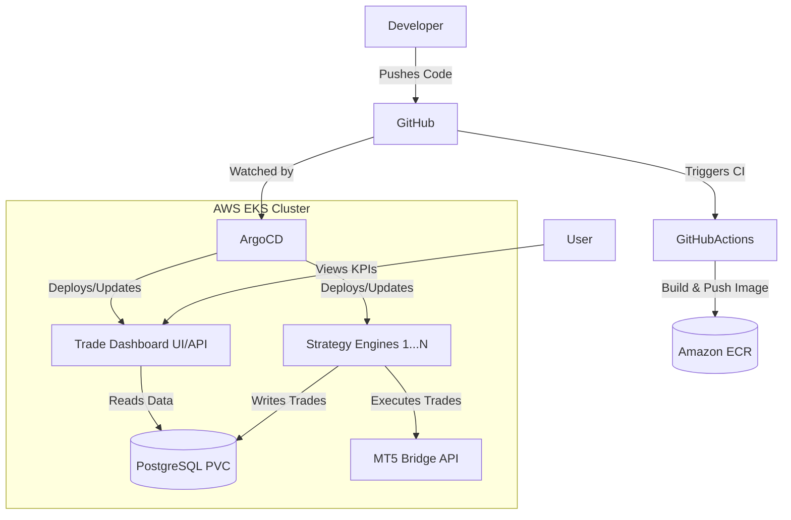

# AlgoFleet Orchestrator

**AlgoFleet Orchestrator** is a cloud-native, highly scalable algorithmic trading platform. It leverages Kubernetes, GitOps, and AWS to orchestrate, monitor, and deploy dozens of algorithmic trading strategies (bots) simultaneously.

## 🏗️ Architecture & Resources

This project is built using modern Platform Engineering and DevOps practices. 

### AWS Infrastructure (Provisioned via Terraform)
* **VPC & Networking:** A custom Virtual Private Cloud with public and private subnets, ensuring database and trading pods are securely isolated from the public internet.
* **Amazon EKS (Elastic Kubernetes Service):** The core container orchestration platform. It manages the lifecycle, scaling, and self-healing of the trading bots.
* **Amazon ECR (Elastic Container Registry):** Securely stores the Docker images for the Strategy Engines and the Dashboard.
* **IAM OIDC Identity Provider:** Allows GitHub Actions to securely authenticate with AWS to build and push Docker images *without* storing long-lived IAM access keys.

### Kubernetes Resources (Deployed via ArgoCD GitOps)
* **Strategy Engines (Python):** Containerized trading bots executing logic on MetaTrader 5 via an API bridge. If a pod crashes, Kubernetes automatically restarts it (Self-Healing).
* **Trade Dashboard (React + FastAPI):** A modern web UI exposed via an AWS Network Load Balancer (NLB) to monitor KPIs, active strategies, and recent trades in real-time.
* **PostgreSQL (StatefulSet + PVC):** A robust relational database deployed securely inside the EKS cluster. It uses AWS EBS (Elastic Block Store) Persistent Volumes to ensure trade data is never lost, even if the database pod is restarted.
* **ArgoCD (GitOps Controller):** Continuously monitors this GitHub repository. When a new trading strategy manifest is pushed to Git, ArgoCD automatically deploys it to the EKS cluster without manual intervention.

## 🔄 CI/CD & GitOps Workflow

1. **Code Commit:** A developer pushes Python strategy code or React UI updates to GitHub.
2. **Continuous Integration (GitHub Actions):** 
   * Runs Python syntax and execution checks.
   * Builds the Docker image.
   * Authenticates with AWS and pushes the image to ECR.
3. **Continuous Deployment (ArgoCD):**
   * ArgoCD detects changes in the `kubernetes/` folder in Git.
   * Automatically synchronizes the EKS cluster to match the desired state in Git.
   * Triggers a rolling update to pull the new Docker images.

## 📊 System Diagram



## 🚀 Setup & Teardown

### 1. Infrastructure (Terraform)
```bash
cd terraform
terraform init
terraform apply -auto-approve
```

### 2. GitOps (ArgoCD)
```bash
kubectl create namespace argocd
kubectl apply -n argocd -f https://raw.githubusercontent.com/argoproj/argo-cd/stable/manifests/install.yaml
kubectl apply -f kubernetes/argocd/tradops-app.yaml
```

### 3. Teardown (Zero-Cost Reset)
```bash
kubectl delete namespace trading argocd --ignore-not-found=true
cd terraform
terraform destroy -auto-approve
```
