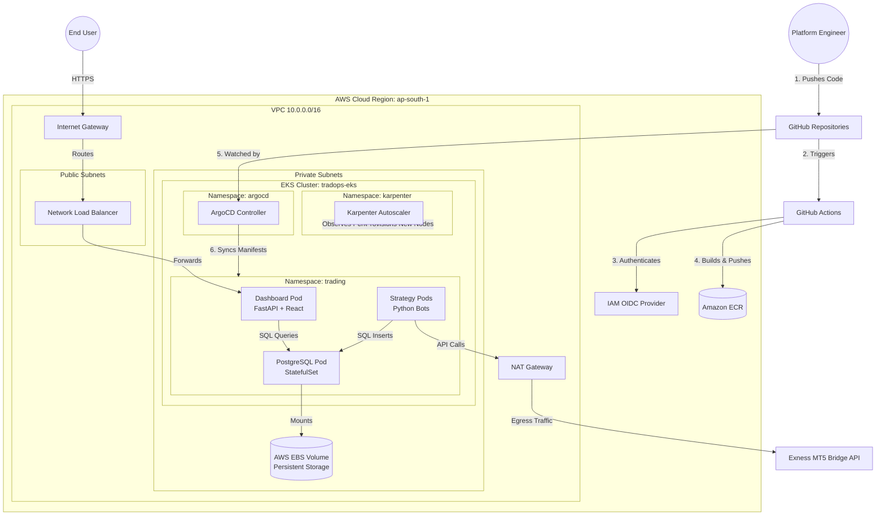

# AlgoFleet Orchestrator

**AlgoFleet Orchestrator** is an enterprise-grade, cloud-native algorithmic trading platform. It leverages Kubernetes, GitOps, and AWS to orchestrate, monitor, and deploy algorithmic trading strategies (MT5 bots) at scale. 

This project demonstrates Senior Platform Engineering architecture, focusing on High Availability (HA), automated CI/CD pipelines, Infrastructure as Code (IaC), and seamless autoscaling.

---

## 🏗️ Deep Architecture

### 1. Cloud Infrastructure (AWS & Terraform)
The foundational infrastructure is strictly provisioned using Terraform, ensuring reproducible and modular deployments.
* **VPC & Networking:** A custom Virtual Private Cloud with strictly segregated Public and Private subnets.
  * **Public Subnets:** House the Network Load Balancers (NLB) and NAT Gateways.
  * **Private Subnets:** House the EKS Worker Nodes. Trading bots are isolated from the public internet for security.
* **Amazon EKS (Elastic Kubernetes Service):** The core control plane and container orchestration platform managing the bot lifecycle.
* **Amazon ECR (Elastic Container Registry):** Private Docker registries storing immutable, version-tagged images for the Strategy Engines and the Dashboard.
* **IAM OIDC Identity Provider:** Secures the CI/CD pipeline by allowing GitHub Actions to request short-lived, scoped STS tokens from AWS, eliminating the security risk of storing static IAM access keys in GitHub.

### 2. Kubernetes Architecture (EKS)
Inside the cluster, workloads are divided into isolated namespaces:

* **Namespace: `trading`**
  * **Strategy Engine Pods (13x Replicas):** Containerized Python trading bots. Each pod runs an isolated algorithm (e.g., *s17-m3m2-v1-btcusd*). Kubernetes Liveness Probes monitor a 60-second heartbeat script. If a bot crashes, Kubernetes instantly replaces it.
  * **Trade Dashboard Pod:** A multi-stage FastAPI + React application serving the frontend UI and REST API.
  * **PostgreSQL (StatefulSet):** A robust relational database inside the cluster. It utilizes a **Persistent Volume Claim (PVC)** backed by an **AWS EBS Volume**, ensuring trade data is permanently saved across node rotations.
  * **Network Load Balancer (NLB):** An AWS Load Balancer automatically provisioned by Kubernetes to route external HTTP traffic to the Dashboard Pod.

* **Namespace: `karpenter`**
  * **Karpenter Node Autoscaler:** Observes incoming pods. If a strategy pod is `Pending` due to lack of CPU/RAM, Karpenter bypasses the traditional autoscaling groups and provisions a perfectly sized EC2 instance in milliseconds to run the pod.

* **Namespace: `argocd`**
  * **ArgoCD Controller:** The GitOps engine. It pulls the desired cluster state directly from Git, preventing configuration drift.

---

## 📊 System Topology Diagram



---

## 🔄 Automated CI/CD & GitOps Pipeline

AlgoFleet implements a strict "Git is the Single Source of Truth" philosophy.

1. **Continuous Integration (Push to Main):**
   * GitHub Actions runs Python syntax and health checks.
   * A multi-stage `Dockerfile` compiles the React frontend and packages it with the FastAPI backend into a single, lightweight image.
   * Actions authenticate with AWS via OIDC and push the image to ECR.
2. **Continuous Deployment (GitOps):**
   * ArgoCD polls the `kubernetes/` directory every 3 minutes (or on webhooks).
   * It detects new image tags or changed Kubernetes manifests (`Deployment`, `Service`, `StatefulSet`).
   * ArgoCD orchestrates a **Zero-Downtime Rolling Update**, spinning up new strategy pods and terminating the old ones only after the new ones pass their Liveness Probes.

## 🚀 Setup & Teardown Instructions

### 1. Provision Infrastructure
```bash
cd terraform
terraform init
terraform apply -auto-approve
```

### 2. Bootstrap ArgoCD
```bash
kubectl create namespace argocd
kubectl apply -n argocd -f https://raw.githubusercontent.com/argoproj/argo-cd/stable/manifests/install.yaml
kubectl apply -f kubernetes/argocd/tradops-app.yaml
```

### 3. Complete Teardown (Zero-Cost Reset)
```bash
kubectl delete namespace trading argocd --ignore-not-found=true
aws secretsmanager delete-secret --secret-id tradops/engine-config --force-delete-without-recovery --region ap-south-1
cd terraform
terraform destroy -auto-approve
```
