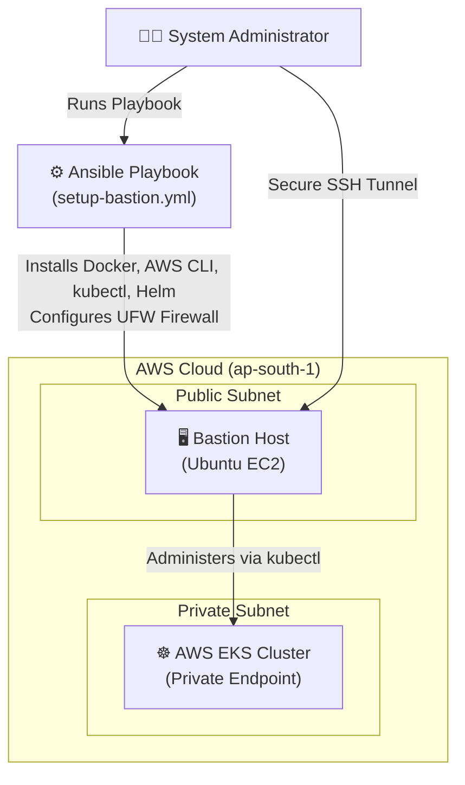
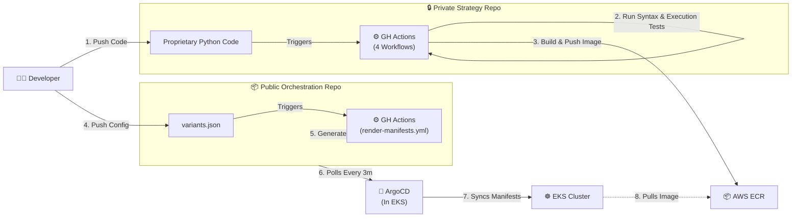
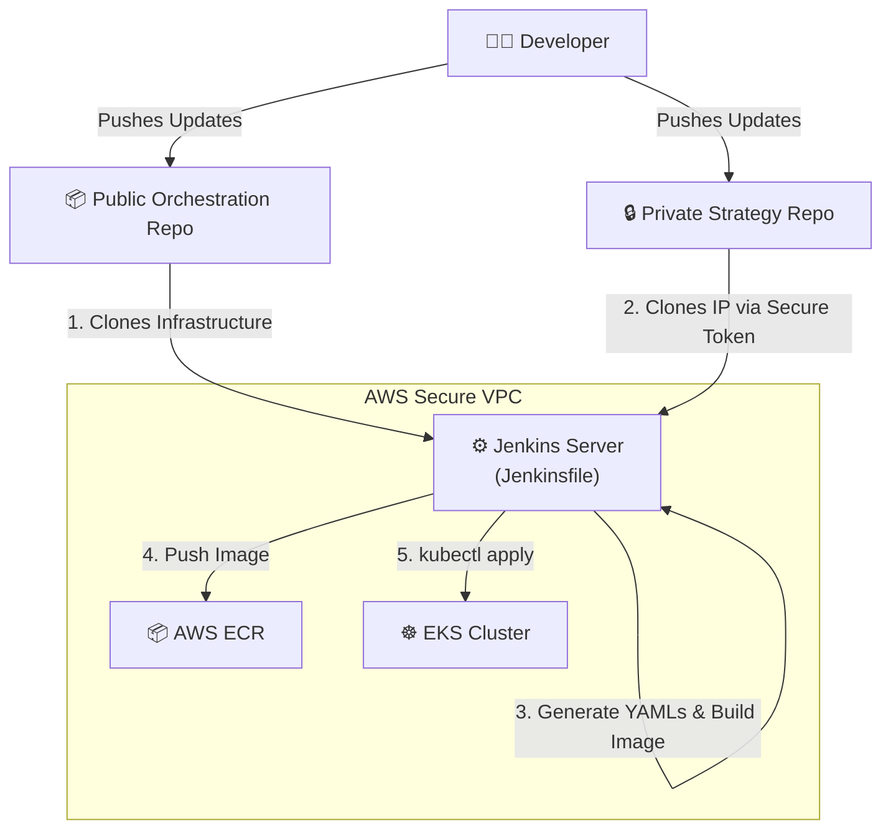
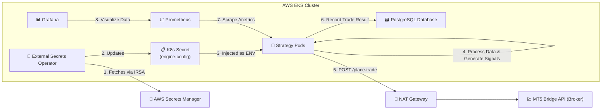

# AlgoFleet Orchestrator — Detailed Flowcharts

This document breaks down the architecture into distinct operational workflows, demonstrating how the system handles Day-0 provisioning, two distinct CI/CD pipelines (GitOps vs Traditional), and real-time trade execution.

---

## 1. Day-0 Infrastructure & Security (Ansible)
Before any code is deployed, the environment must be secured. We never expose the Kubernetes control plane or worker nodes to the public internet.

---

## 2. Pipeline Option A: Modern GitOps (GitHub Actions + ArgoCD)
This is the primary, highly-automated deployment path leveraging the dual-repository setup.

---

## 3. Pipeline Option B: Traditional Enterprise (Jenkins)
As an alternative to GitOps, a centralized Jenkins server acts as a secure deployment bridge. This proves the ability to work in strict enterprise environments that avoid public GitHub Actions runners for proprietary IP.

---

## 4. Trade Execution & Observability Flow
Once the pods are deployed via either pipeline, this is how they interact with the broker and the monitoring stack.

