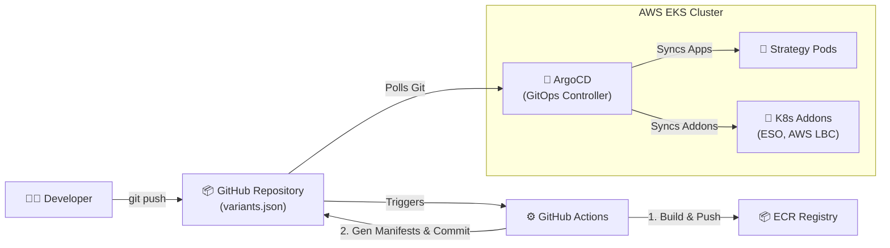
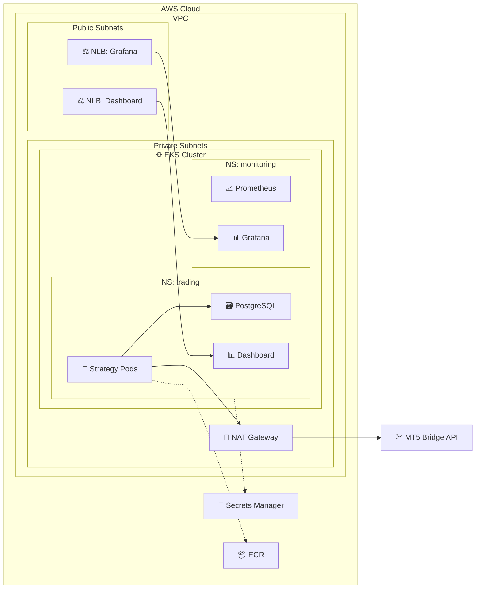

# AlgoFleet Orchestrator Flowchart

This flowchart demonstrates the end-to-end flow of the project, separating the infrastructure architecture from the data/trade flow.

## 1. CI/CD & Deployment Flow



## 2. Secrets Management Flow

```mermaid
flowchart TD
    SM["🔐 AWS Secrets Manager\n(MT5 Creds, DB URL)"]
    
    subgraph "AWS EKS Cluster"
        ESO["🔑 External Secrets Operator"]
        K8S_SEC["📋 K8s Secret\n(engine-config)"]
        BOTS["🤖 Strategy Pods"]
    end
    
    ESO -->|Fetches via IRSA (1h)| SM
    ESO -->|Creates/Updates| K8S_SEC
    K8S_SEC -->|Injected as ENV| BOTS
```

## 3. Trade Execution & Data Flow

```mermaid
flowchart TD
    subgraph "AWS EKS Cluster"
        BOTS["🤖 Strategy Pods\n(Python Algorithms)"]
        PG["🗃️ PostgreSQL\n(Trade Database)"]
        DASH["📊 Trade Dashboard\n(FastAPI)"]
        PROM["📈 Prometheus\n(Metrics)"]
        GRAF["📊 Grafana\n(Dashboards)"]
    end
    
    MT5["💹 MT5 Bridge API\n(Broker Server)"]
    
    BOTS -->|1. Fetch Market Data & Send Trade (POST)| MT5
    BOTS -->|2. Record Trade Result| PG
    DASH -->|3. Query Status| BOTS
    PROM -->|4. Scrape /metrics| BOTS
    GRAF -->|5. Visualize| PROM
```

## 4. Complete System Architecture


