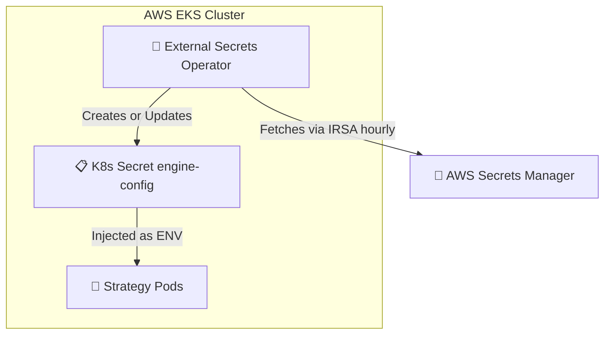
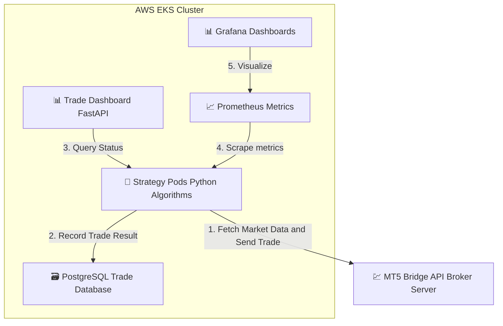
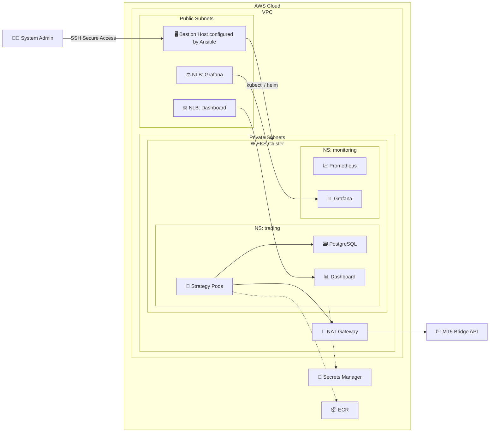

# AlgoFleet Orchestrator Flowchart

This flowchart demonstrates the end-to-end flow of the project, separating the infrastructure architecture from the data and trade flow.

## 1. CI/CD & Deployment Flow (GitHub Actions & Jenkins)

```mermaid
flowchart LR
    DEV["👨‍💻 Developer"] -->|git push| REPO["📦 Public DevOps Repository"]
    
    PRIV_REPO["🔒 Private Strategy Engine Repo"]
    
    REPO -->|1. triggers (variants.json)| GHA["⚙️ GitHub Actions"]
    GHA -->|2. Gen Manifests and Commit| REPO
    
    REPO -->|3. Triggers| JENKINS["⚙️ Jenkins CI/CD"]
    PRIV_REPO -->|4. Securely Cloned| JENKINS
    
    JENKINS -->|5. Build and Push| ECR["📦 ECR Registry"]
    
    REPO -->|6. Polls Git| ARGO["🐙 ArgoCD GitOps Controller"]
    
    subgraph "AWS EKS Cluster"
        ARGO -->|Syncs Apps| BOTS["🤖 Strategy Pods"]
        ARGO -->|Syncs Addons| ADDONS["🔌 K8s Addons"]
    end
```

## 2. Secrets Management Flow



## 3. Trade Execution & Data Flow



## 4. Complete System Architecture with Bastion Host


