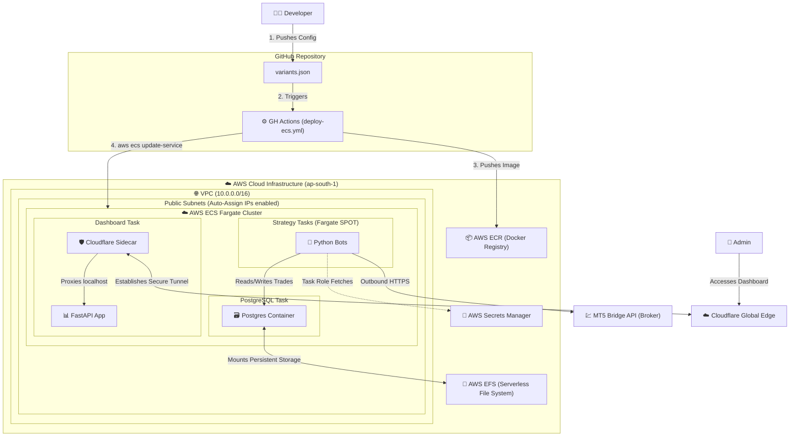

# Serverless ECS Architecture (Version 2)

Welcome to **Version 2** of the AlgoFleet Orchestrator. 

While Version 1 prioritizes enterprise-grade Kubernetes scaling, this version is aggressively architected for **Cloud FinOps** (Financial Operations). The goal of Version 2 is to strip the AWS infrastructure bill from ~$280/month down to **under $40/month**, while maintaining a fully automated, containerized, and highly available microservices platform.

## 🏛️ Serverless Architecture Diagram

## 💰 The Cost Optimization Strategy

This architecture achieves an ~85% cost reduction by leveraging the following Serverless and Zero-Trust principles:

1. **Eliminated the Kubernetes Tax (-$73/mo):** By moving to ECS Fargate, the control plane is 100% free. We only pay for the exact compute time the containers consume.
2. **Fargate Spot Pricing (-$90/mo):** Instead of running On-Demand EC2 instances, the trading strategies run on Fargate Spot, providing up to a 70% discount on compute costs.
3. **Zero-Trust Tunnels vs AWS Load Balancers (-$18/mo):** Instead of provisioning an expensive AWS Application Load Balancer, the Trade Dashboard is exposed securely to the internet via a `cloudflared` sidecar container establishing a free, encrypted tunnel to Cloudflare.
4. **Serverless Database Storage (-$15/mo):** Instead of paying for a Managed RDS instance, PostgreSQL runs as a standard Fargate task and mounts an AWS EFS (Elastic File System) volume for persistent, pay-per-byte storage (costing roughly $1.50/month).
5. **No NAT Gateway (-$41/mo):** Fargate tasks are placed directly in Public Subnets (secured tightly via AWS Security Groups), completely avoiding the massive AWS NAT Gateway hourly fee.

## 🚀 CI/CD & Automation
*See [flowchart/flowchart.md](./flowchart/flowchart.md) for detailed workflow diagrams.*

Instead of utilizing a Pull-based GitOps controller like ArgoCD, this architecture utilizes a streamlined **Push-based model**. A Python script (`scripts/gen_ecs_tasks.py`) dynamically reads the `variants.json` config and generates exact ECS JSON payloads. GitHub Actions then executes native AWS API calls to perform zero-downtime rolling updates on the ECS cluster.
