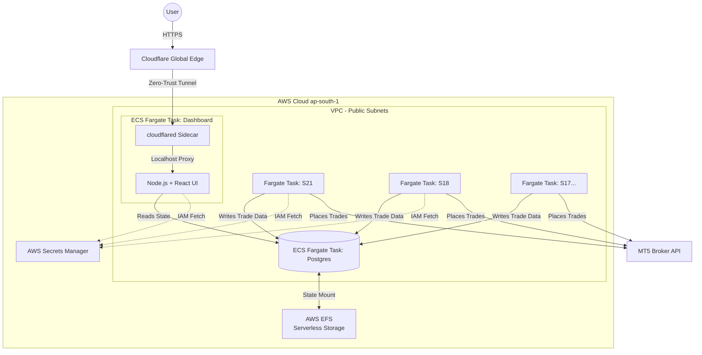

# 🌩️ Version 2: Serverless ECS & Zero-Trust Architecture

This directory contains **Version 2** of the AlgoFleet Orchestrator. 

While Version 1 (Enterprise EKS) was designed to showcase high-end Kubernetes orchestration suitable for massive, highly compliant institutions, **Version 2 is a masterclass in Cloud FinOps (Financial Operations).** 

By stripping away the heavy baseline costs of managed Kubernetes, Load Balancers, and NAT Gateways, this version achieves a **100% serverless, zero-trust architecture** that slashes operating costs by over 85% (from ~$280/month down to under $40/month) without sacrificing automation or high availability.

---

## 🏗️ Architecture Flowchart



---

## 🔬 Core Architectural Shifts (V1 vs V2)

### 1. Compute: EKS to ECS Fargate Spot
*   **The Problem:** EKS charges a flat $73/month just for the control plane, plus the cost of idle EC2 worker nodes.
*   **The V2 Solution:** We shifted to **AWS ECS (Elastic Container Service)**, where the control plane is 100% free. By leveraging **Fargate Spot**, AWS provisions our algorithmic containers on spare data center capacity at a ~70% discount. We pay exclusively for the exact seconds our bots run, requiring zero node maintenance.

### 2. Networking: NAT + ALB to Zero-Trust Edge
*   **The Problem:** Private subnets require a NAT Gateway ($41/mo) to reach the internet. Exposing a dashboard requires an Application Load Balancer ($18/mo).
*   **The V2 Solution:** Tasks are placed in **Public Subnets** with hyper-strict Security Groups that deny all inbound traffic. This allows bots to reach the broker APIs without a NAT Gateway. To expose the dashboard, we use a **Cloudflare Tunnel (cloudflared)** sidecar container. It establishes an outbound-only encrypted tunnel to Cloudflare, meaning zero AWS inbound ports are open, and the ALB is completely eliminated.

### 3. Storage: Managed RDS to Serverless EFS
*   **The Problem:** AWS RDS requires a persistent, always-on underlying instance, starting at ~$15/month for the smallest size.
*   **The V2 Solution:** We containerized a standard `postgres:15-alpine` image as a Fargate Task. To make the database persistent across restarts, we attached **AWS EFS (Elastic File System)**. EFS scales dynamically and costs ~$0.33/GB per month. For typical trading logs, this drops database storage costs to ~$1.00/month.

### 4. CI/CD: ArgoCD (Pull) to GitHub Actions API (Push)
*   **The Problem:** ArgoCD requires a dedicated Kubernetes controller running 24/7, consuming memory just to poll Git for changes.
*   **The V2 Solution:** A purely push-based, event-driven CI/CD model. Pushing changes to `variants/variants.json` triggers a GitHub Actions workflow. The workflow runs `gen_ecs_tasks.py` to compile native ECS JSON payloads, and uses the AWS CLI to instantly update the ECS services.

---

## 💰 Cloud FinOps Cost Breakdown

This entire architecture operates on a consumption-based model. Total monthly infrastructure costs (ap-south-1):

| Resource | V2 Cost / Month | Replaces (V1 Cost) |
| :--- | :--- | :--- |
| **Control Plane** | $0.00 | EKS Control Plane ($73.00) |
| **Compute (Spot)** | ~$33.00 (10 bots + UI + DB) | EC2 Worker Nodes ($100.00+) |
| **Ingress Routing** | $0.00 (Cloudflare Free Tier) | AWS ALB ($18.00) |
| **Outbound Routing**| $0.00 (Public Subnet) | NAT Gateway ($41.00) |
| **Database Storage**| ~$1.00 (AWS EFS) | Managed RDS ($15.00+) |
| **Total** | **~$34.00 / month** | **~$247.00+ / month** |

---

## 🚀 How to Start Version 2

Because Version 2 is completely serverless, the spin-up process is entirely automated via Infrastructure as Code (Terraform) and CI/CD pipelines.

### Phase 1: Provision Infrastructure
This step creates the VPC, ECS Cluster, ECR repositories, EFS Drive, and IAM Roles.
```bash
cd serverless-ecs-architecture/terraform
terraform init
terraform apply -auto-approve
```

### Phase 2: Inject Secrets
Terraform creates a blank secret in AWS Secrets Manager. Populate it using the script at the root of the repository:
```bash
export TELEGRAM_BOT_TOKEN="your_token"
export MT5_API_KEY="your_api_key"
cd ../../
./scripts/setup-secrets.sh
```

### Phase 3: Trigger Deployment
We use a **Push-Based CI/CD** pipeline. Modify your `variants/variants.json` to configure which strategies should run, then push to the `main` branch on GitHub:
```bash
git add variants/variants.json
git commit -m "feat: deploy ECS fleet"
git push origin main
```
**What happens behind the scenes:** GitHub Actions will compile the JSON definitions, push the Docker images to ECR, and execute the `aws ecs update-service` commands. Your Fargate Spot instances will spin up in seconds.

### Phase 4: Access the Dashboard
Because of our Zero-Trust architecture, you do not need to query AWS for an IP or Load Balancer URL. The moment the Dashboard Fargate task boots, the Cloudflare sidecar container will securely tunnel the application to your pre-configured Cloudflare domain (e.g., `dashboard.your-domain.com`).
