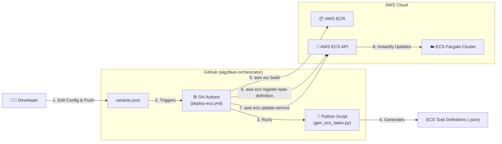
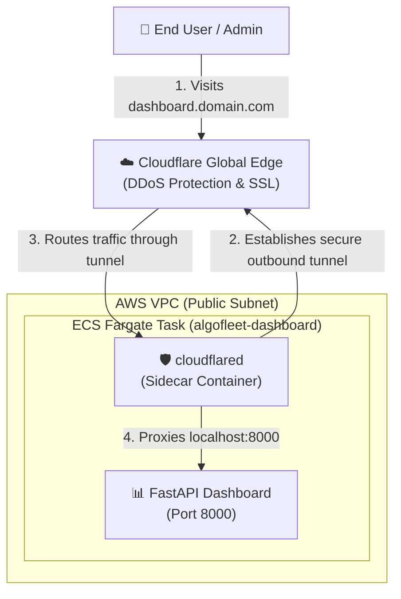
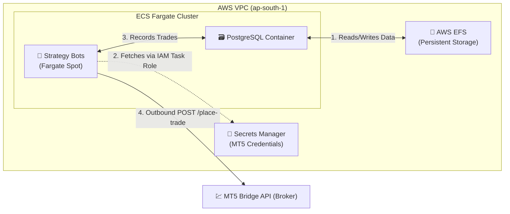

# Serverless ECS Orchestrator — Detailed Flowcharts

This document breaks down the ultra-lean, cost-optimized Serverless architecture into distinct operational workflows. It demonstrates how we achieve high availability and Zero-Trust networking for under $40/month.

---

## 1. CI/CD Pipeline (Push-Based Serverless Automation)
Unlike Kubernetes which uses a Pull-based GitOps controller (ArgoCD), this architecture uses a highly automated Push-based model native to AWS.

---

## 2. Zero-Trust Ingress Flow (Cloudflare Tunnels)
To eliminate the $18/month AWS Application Load Balancer fee, we use a Cloudflare Tunnel sidecar. This exposes the internal dashboard securely to the internet without requiring public inbound ports.

---

## 3. Trade Execution & Stateful Storage Flow
Fargate containers are stateless. To run a database without paying for AWS RDS, we mount a serverless Elastic File System (EFS) directly into the PostgreSQL container.

